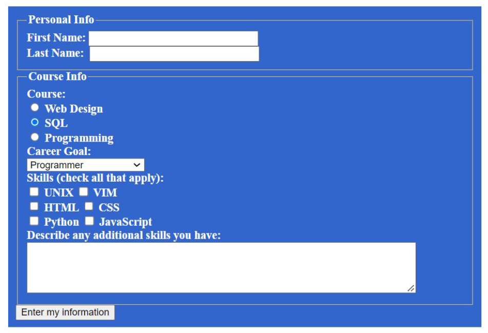

# firstForm
Create a form with minimum fields those shown in the image.
- 3 fields should be required
- 1 field should be readonly with some default data
- add password field with minimum 8 characters
- all fields should have placeholder
- add reset button
- add file input which will accept only images
